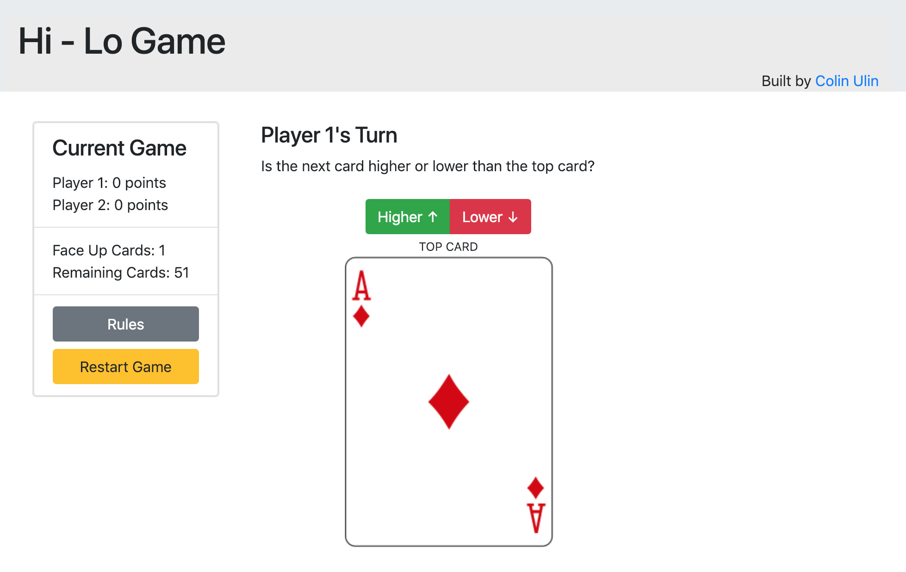

# Hi - Lo Game
> A great little card game that can be played with two players.



This game was built for a front-end software engineer application coding challenge. It was developed on the VueJS framework as a single-page application (SPA). The app uses Vuex for state management, Axios for API requests to the [Deck of Cards API](http://deckofcardsapi.com/), and Vue Router for routing.

## Installation

Clone or download this repo and navigate to the application folder in your terminal.

OS X & Linux with Yarn run:

```sh
yarn install
```

OR with NPM run:

```sh
npm install
```

## Development setup

After installing all dependencies, run the following shell script in the application root folder to start the development server:

```sh
yarn dev
```

Or with NPM:

```sh
npm run dev
```

Running the above script should open a browser window with the app running. If a browser window does not open after running the above script, navigate to `http://localhost:8080/` in your browser. If you still experience issues, check that there aren't any errors in your terminal and that VueJS is running on port 8080.

## Deployment

Once you are ready to compile and deploy the app, navigate to the app folder and run:

```sh
yarn build
```

Or with NPM:

```sh
npm run build
```

Running this script creates a new folder, called "dist", which contains all of the necessary JS files to run Hi - Lo as a standalone app. Upload index.html and the dist directory to your server to deploy the production app.

## Release History

* 0.0.1
    * Completed working beta of game

## Author

Colin Ulin – [@colinulin](https://twitter.com/colinulin) – colinulin@gmail.com
